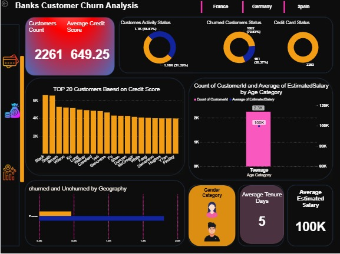

# Bank-Churn-Customer-Analysis

✨ Project Overview

This project presents an interactive Power BI dashboard analyzing customer churn data for a fictional bank. It helps identify patterns and insights on why customers leave and highlights key metrics for business decisions.

🎯 Objectives

Analyze churned vs. retained customers.

Identify top customers based on credit score.

Segment churn by geography and demographics.

Provide KPIs for decision-making.

## 📌 Key Features

- KPI Cards: Total Customers, Average Credit Score, Average Estimated Salary, Average Tenure Days
- Dynamic Slicers: Filter by geography, gender, credit card status
- Visuals:

1.Bar Chart: Top 20 customers by credit score

2.Pie Charts: Churn status & credit card status

3.Column Chart: Estimated salary by age category

4.Stacked Bar: Churned vs. Unchurned by geography

## ✨ Tools Used

- Power BI Desktop

- DAX Measures for dynamic KPIs
- 
## Dataset:

This dataset contains customer details like:

Customer ID, Credit Score, Geography, Gender

Age, Tenure, Balance, Estimated Salary

Churn Status (Yes/No).
